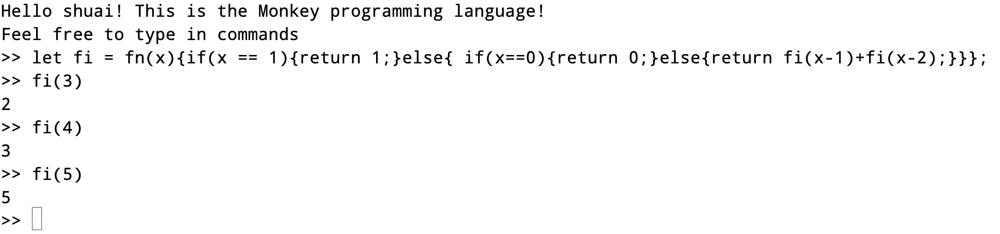

### lexer

词法分析：主要是用的是有限状态自动机算法进行识别token。

### parse

语法分析树ast：将内容分为表达式、语句进行区分。例如return语句，let语句，表达式语句，块语句{}。表达式分为identifier 、INT、还有就是前缀、中缀组合可以是表达式,还有call fn返回表达式结果,函数也是一个表达式,if 也是表达式。之后为了方便查看语法数的内容将语法树的输出转换成了json格式进行查看。

是用的是自上而下的运算符优先级分析（普拉特解析法）

普拉特解析法介绍：构建AST树最大的难点在于如何进行正确的嵌套括号。例如

```
1 + 2 + 3       ---->     ((1 + 2) + 3) 
```

```
1.前置条件：注册相关的前缀解析函数，例如当前的token是int型的前缀解析函数，以及注册中缀解析函数运算符+ - * /
2.算法介绍：
	1)函数的初始参数是设置优先级最低的。
	2)首先对于一个表达式第一个token必定是一个已经被注册过有相关的前缀解析函数的。
	3)调用相关的前缀解析函数获取前缀值。
	4)查看下一个token，例如+的优先级是否大于当前的优先级，如果当前的优先级较大，则直接返回前缀值，函数结束。
否则进入步骤5
	5)由于当前的优先级较小，后面的优先级比较大，将中缀解析函数进行合并到当前中，然后调用注册的中缀函数，该中缀函数会递归的调用当前函数，传入相关的优先级。
	6)由于最初的函数的优先级是最低的所有当前的表达式会合并完毕。
```

### evalutor

根据生成的语法树进行求值。

递归的对树进行求值，如果递归到根结点直接进行求值，否则继续向下递归下去。代码的简写流程如下所示。

```go
function eval(astNode) {
  if (astNode is integerliteral) {
    return astNode.integerValue
  } else if (astNode is booleanLiteral) {
    return astNode.booleanValue
  } else if (astNode is infixExpression) {
    leftEvaluated = eval(astNode.Left)
    rightEvaluated = eval(astNode.Right)
    if astNode.Operator == "+" {
      return leftEvaluated + rightEvaluated
    } else if ast.Operator == "-" {
      return leftEvaluated - rightEvaluated
    }
  }
}
```

斐波那契数。


