# 数组问题

## 前缀和(连续的范围求和)

和连续下标有关系或者连续数组有关系，寻找前缀和

对数组某一范围left---right下标进行求和，思考某种情况能不能建立一个数组进行在o(1)的情况下进行。

- 数组的left到right下标求和
- 分数min到max范围内的人数
- 扩大到范围比如说在二维数组中左上角到右下角的范围内的和

```go
for i := 0; i < len(arr); i++ {
   for j := i; j < len(arr); j++ {
      fmt.Println(i, j)
   }
}
for i := 0; i < len(arr); i++ {
   for j := 0; j <= i; j++ {
      fmt.Println(j, i)
   }
}
```

查看上面的两个for循环有什么区别，对于上面的for来说内层for循环越来越少，对于下面的for循环来说内层for循环越来越多，最后的结果可能顺序是不一致的但是结果在某种程度上是一致的，有过想要优化的角度上来说，上面的for考虑的应该是每一次减少到底是为了什么，下面的for考虑的是每一次的增加与上一次到底有什么区别，相比而言增加的更加容易优化。

常用的场景，在元素组不改变的情况下，求解left到right下标之间的数组和。

### 代码模板

```go
type NumArray struct {
   arr []int
}

// Constructor 构造前缀和
func Constructor(nums []int) NumArray {
   arr := make([]int, len(nums)+1)
   for i := 0; i < len(arr); i++ {
      arr[i+1] = arr[i] + nums[i]
   }
   return NumArray{arr}
}

// SumRange fa区间[i,j]数组和
func (n *NumArray) SumRange(i, j int) int {
   return n.arr[j+1] - n.arr[i]
}
```


## 差分数组(连续范围累加)

背景：当对于数组某一范围比如说是left到right范围进行加上val不断的重复left，right，val的操作，如果使用for循环对其进行增加那么就会在o(n)的时间上完成对数组元素的增加。


### 代码模板

```go
type NumArray struct {
	arr []int
}

// Constructor c
func Constructor(nums []int) NumArray {
	for i := len(nums) - 1; i > 0; i-- {
		nums[i] = nums[i] - nums[i-1]
	}
	return NumArray{nums}
}

// add 对[i,j]范围内的数组元素进行增加val
func (n NumArray) add(i, j, val int) {
	n.arr[i] += val
	if j+1 < len(n.arr) {
		n.arr[j+1] -= val
	}
}

// result 对数组进行还原
func (n NumArray) result() []int {
	for i := 1; i < len(n.arr); i++ {
		n.arr[i] = n.arr[i-1] + n.arr[i]
	}
	return n.arr
}
```


## 滑动窗口

- **选取最小的子连续数组或者字符串**
- 主要的思路是r指针向后移动，查看当前的情况是否满足need需要的情况，如果不满足继续向后移动
- 如果满足了记录下当前的符合情况的时候。
- 最小化，需要l向后移动进行缩小化，直到向后移动到不满足的时候，然后r在向后移动满足，到达上一步

其中`l`向右移动的条件判断需要找到，有时`cnt == len(need)`有时`r-l >= len(s1)`

`r`向后移动是寻找可行解的，`l`向后移动是最小化可行解的

**重点：找到什么时候`l`向后移动是比较重要的。**

### 代码模板


```go
func minWindow(s string, t string) string {
	//need表示map[char]cnt,window表示当前的[l,r)中的char的个数
	need, window := make(map[uint8]int), make(map[uint8]int)
	for i := 0; i < len(t); i++ {
		need[t[i]]++
	}
	l, r := 0, 0
	cnt := 0 //记录满足当前多少个need的长度
	start, length := 0, math.MaxInt
	for r < len(s) {
		//如果是需要的字符串则进行window加一
		if _, tag := need[s[r]]; tag {
			window[s[r]]++
			//当前的window内的值满足need需要的数目，cnt++
			if num := window[s[r]]; num == need[s[r]] {
				cnt++
			}
		}
		r++
		//已经满足需要l右移
		for cnt == len(need) {
			if r-l < length {
				start = l
				length = r - l
			}
			if _, tag := need[s[l]]; tag {
				if window[s[l]] == need[s[l]] {           //注意此处判断是否相等cnt--
					cnt--
				}
                window[s[l]]--                            //右移l，字符存在need
			}
			l++
		}
	}
    if length == math.MaxInt {
		return ""
	}
	return s[start : start+length]
}
```


## 二分查找

- `for l <= r{ ... }`，此处跳出循环是<=，如果是<，会漏掉 `l==r` 的情况

  下面的代码对于搜索值的左边界或者是有边界并不是很好。例如：nums = [1,2,2,2,3]，target 为 2，使用二分查找算法返回的是2，但是如果我想找最左边的2，或者是最右边的2，如果再根据向左右扩展的话有可能退化到o(n)的时间复杂度。

根据`r`==什么的情况来判断搜索的区间，比如`r==len-1`代表搜索的区间是`[l : r]`闭区间

根据`r`的值即可推出for跳出的情况，以及`l、r`的更新情况


**二分查找**

```go
func search(nums []int, target int) int {
	l, r := 0, len(nums)-1
	for l <= r {
		mid := l + (r-l)/2
		if nums[mid] == target {
			return mid
		} else if nums[mid] > target {
			r = mid - 1
		} else {
			l = mid + 1
		}
	}
	return -1
}
```


**二分查找左边界**

左边界的适用范围，可以有效地适用到找到有多少个小于某个数 

nums = [2,3,5,7], target = 8，算法会返回 4，含义是：nums 中⼩于 8 的元素有 4 个

输出的是小于的个数，最后可以加上两个判断即可判断有没有查找的值

 `return nums[left] == target ? left : -1;`，`if (left == nums.length) return -1;` 

```go
func leftSearch(nums []int, target int) int {
	if len(nums) == 0 {
		return -1
	}
	l, r := 0, len(nums)
	for l < r {
		mid := l + (r-l)/2
		if nums[mid] == target {
			r = mid
		} else if nums[mid] > target {
			r = mid
		} else if nums[mid] < target {
			l = mid + 1
		}
	}
	return l
}
```

分析上面的代码`r == len(nums)`可以得知搜索的区间是`[l , r)`当`nums[mid] == target`我们需要得到最左边的所以需要`r = mid`，`nums[mid] > target`的时候需要r左移根据右面是开区间所以只需要`r = mid`即可不包含mid位置的值。

如果只有一个的情况，将会是`l==r`并且是`nums[l] == target`返回l即可。


**另一种查找左边界**

分析下面的代码跳出的情况是  `l = r+1`也就是说 `l`有可能超出数组的边界，所以需要进行边界的检查

```go
func leftSearch(nums []int, target int) int {
   l, r := 0, len(nums)-1
   for l <= r {
      mid := l + (r-l)/2
      //不要怕 -1 因为如果前面没有符合的情况，
      //那么最后l会指向r的后一位，也就是当前的mid符合的情况的时候
      if nums[mid] == target {
         r = mid - 1
      } else if nums[mid] > target {
         r = mid - 1
      } else if nums[mid] < target {
         l = mid + 1
      }
   }
   return l
}
```

边界检查：

```go
if l >= len(nums) || nums[l] != target {
   return -1
}
```


**右侧边界二分查找**

```go
func rightSearch(nums []int, target int) int {
   l, r := 0, len(nums)
   for l < r {
      mid := l + (r-l)/2
      if nums[mid] == target {
         //加一是为了跳出循环，不然的话可能会永远的[3,4] mid==3符合条件
         l = mid + 1 
      } else if nums[mid] > target {
         r = mid
      } else if nums[mid] < target {
         l = mid + 1
      }
   }
   return l - 1
}
```

另一种右侧边界查找

```go
func rightSearch(nums []int, target int) int {
   l, r := 0, len(nums)-1
   for l <= r {
      mid := l + (r-l)/2
      if nums[mid] == target {
         l = mid + 1
      } else if nums[mid] > target {
         r = mid - 1
      } else if nums[mid] < target {
         l = mid + 1
      }
   }
   return r
}
```


### 代码示例

```go
func search(nums []int, target int) int {
	l, r := 0, len(nums)-1
	for l <= r {
		mid := l + (r-l)/2
		if nums[mid] == target {
			return mid
		} else if nums[mid] > target {
			r = mid - 1
		} else {
			l = mid + 1
		}
	}
	return -1
}

func leftSearch(nums []int, target int) int {
	l, r := 0, len(nums)-1
	for l <= r {
		mid := l + (r-l)/2
		if nums[mid] == target {
			//举例说明用不用-1
			//注意此处举例[3,4]区间target = 3，[3,3]
			r = mid - 1
		} else if nums[mid] > target {
			r = mid - 1
		} else {
			l = mid + 1
		}
	}
    //l = r + 1跳出循环，l可能越界
	if l == len(nums) || nums[l] != target {
		return -1
	}
	return l
}

func rightSearch(nums []int, target int) int {
	l, r := 0, len(nums)-1
	for l <= r {
		mid := l + (r-l)/2
		if nums[mid] == target {
			//举例说明用不用+1
			//注意此处举例[3,4]区间target = 3，[3,3]
			l = mid + 1
		} else if nums[mid] > target {
			r = mid - 1
		} else {
			l = mid + 1
		}
	}
	//r = l - 1，r可能是-1
	if r < 0 || nums[r] != target {
		return -1
	}
	return r
}
```


### 使用场景

```
珂珂喜欢吃香蕉。这里有 N 堆香蕉，第 i 堆中有 piles[i] 根香蕉。警卫已经离开了，将在 H 小时后回来。

珂珂可以决定她吃香蕉的速度 K （单位：根/小时）。每个小时，她将会选择一堆香蕉，从中吃掉 K 根。如果这堆香蕉少于 K 根，她将吃掉这堆的所有香蕉，然后这一小时内不会再吃更多的香蕉。  

珂珂喜欢慢慢吃，但仍然想在警卫回来前吃掉所有的香蕉。

返回她可以在 H 小时内吃掉所有香蕉的最小速度 K（K 为整数）。

输入: piles = [3,6,7,11], H = 8
输出: 4
```

题目中让求的是速度，我们可以以速度为f(x)的横坐标，不断地二分查找速度的范围，然后确定是否是最小的速度，进行对题目的解答。

有两方面需要进行考虑

- 根据题目要求寻找min以及max，也就是搜索的下标的边界
- 然后根据已知的数组，求出与要求的是否符合，也就是比较`==`，`>`，`<`的情况重赋值min或者max


## 快慢指针

用于o(1)的时间复杂度之内原地删除重复的数组元素(**有序的元素**)

或者对数组中的num==target的值进行删除

### 代码例子

```go
func removeDuplicates(nums []int) int {
	l, r := 0, 1
	for r < len(nums) {
        //如果不一致进行赋值左指针右移
		if nums[r] != nums[l] {
			l++
			nums[l] = nums[r]
		}
		r++
	}
    //返回删除重复元素后元素的个数
	return l + 1
}
```


# 链表问题


## 链表结构体


## 两个有序链表合并

```go
func mergeTwoLists(list1 *ListNode, list2 *ListNode) *ListNode {
   head := &ListNode{-1, nil}
   last := head
   p := list1
   q := list2
   for p != nil && q != nil {
      if p.Val < q.Val {
         last.Next = p
         p = p.Next
      } else {
         last.Next = q
         q = q.Next
      }
      last = last.Next
   }
   if p != nil {
      last.Next = p
   }
   if q != nil {
      last.Next = q
   }
   return head.Next
}
```


## 一次遍历解决的问题


- **删除链表倒数第K个节点**(假设链表的长度是n，)

首先让p1指针先走k步，此时然后p2开始与p1一起走，直到p2是空的此时p1的节点就是该删除的节点(实际操作可以是p1的下一个是空的停止，可以让p2指向前一个便于删除后一个节点)

```go
func removeNthFromEnd(head *ListNode, n int) *ListNode {
   p1 := head
   for i := 0; i < n; i++ {
      p1 = p1.Next
   }
   //p1到最后代表删除第一个节点
   if p1 == nil {
      return head.Next
   }
   p2 := head   //最后指向删除节点的前一个结点
   for p1.Next != nil {
      p1 = p1.Next
      p2 = p2.Next
   }
   p2.Next = p2.Next.Next
   return head
}
```


- **返回链表的中间的节点**(如果链表长度是双数返回后一个节点)

快慢指针，快的指针每一次向后两个，慢的每一次向后一个，向后两个这个时候需要进行边界的思考，当前fast不能是空，并且下一个节点也不能是空的。

```go
func middleNode(head *ListNode) *ListNode {
	slow, fast := head, head
	for fast != nil && fast.Next != nil {
		fast = fast.Next.Next
		slow = slow.Next
	}
	return slow
}
```


## 判断链表是否成环

使用快慢指针，快的前进两步，慢的前进一步，如果最后快的遇到空指针则不是环，如果慢指针与快指针相遇则成环。

如果链表成环返回，环的最开始的节点。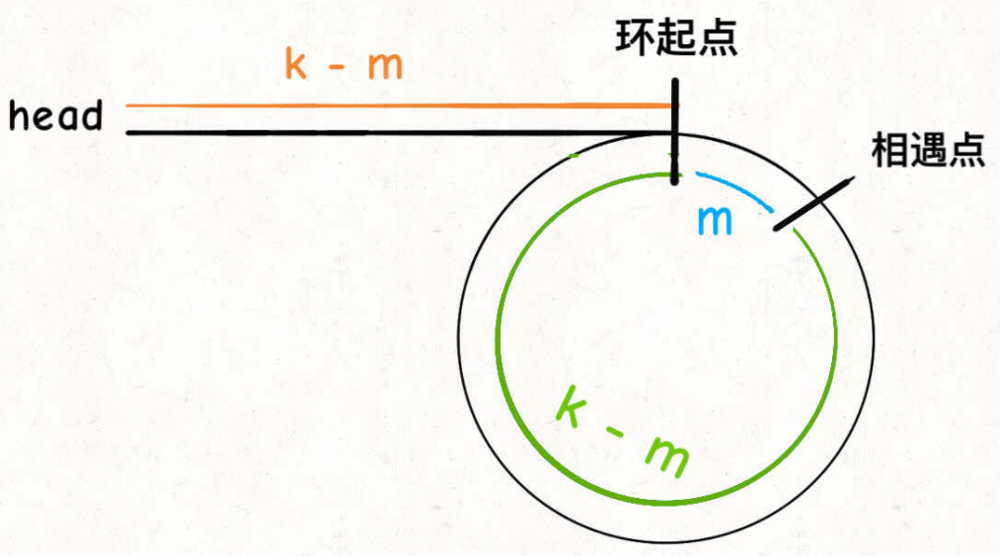


首先让快指针走2步，慢指针走1步。假设慢指针走了k步，快指针2k步，相遇必定在环中。可以得出环的长度是k，假设环的起点到相遇点的距离是m，那么根据慢指针可以得知`k-m`是head到环起点的长度，这与快指针剩下环的长度是相同的。

算法思路：快指针2步，慢指针1步，直到相遇，使慢指针重新指向head，然后快慢指针以相同的速度进行，直到再次相遇就是环的起始节点。

```java
    ListNode detectCycle(ListNode head) {
        ListNode fast, slow;
        fast = slow = head;
        while (fast != null && fast.next != null) {
            fast = fast.next.next;
            slow = slow.next;
            if (fast == slow) break;
        }
        // 上⾯的代码类似 hasCycle 函数
        if (fast == null || fast.next == null) {
            // fast 遇到空指针说明没有环
            return null;
        }
        // 重新指向头结点
        slow = head;
        // 快慢指针同步前进，相交点就是环起点
        while (slow != fast) {
            fast = fast.next;
            slow = slow.next;
        }
        return slow;
    }
```


## 找出相交的链表

给你两个单链表的头节点 `headA` 和 `headB` ，请你找出并返回两个单链表相交的起始节点。如果两个链表不存在相交节点，返回 `null` 。

链表的长度不相同，可以在逻辑上遍历完A在遍历B，同时遍历完B在遍历A，这样最终的长度就会相同的，并且重复的元素也没有改变(当然这是长度不相同的时候)，如果长度相同直接遍历就好了。

```go
func getIntersectionNode(headA, headB *ListNode) *ListNode {
   p, q := headA, headB
   //如果相等可以直接返回(注如果没有相同的部分，最后p==q==nil也会跳出)
   for p != q { //最终会在p.next==q.next==nil，都执行完else然后for判断跳出
      if p == nil {
         p = headB
      } else {
         p = p.Next
      }
      if q == nil {
         q = headA
      } else {
         q = q.Next
      }
   }
   return p
}
```


换一种思路如果将A的终点脸上B的起点，**那么该问题就会变成寻找环的起点的问题**。


## 反转链表递归思路

```go
// reverse 递归反转链表
func reverse(head *ListNode) *ListNode {
	//递归出口，如果没有节点或者只有一个不需要进行翻转
	if head == nil || head.Next == nil {
		return head
	}
	//进行递归，返回的是后面已经反转后的头节点
	last := reverse(head.Next)
	//核心代码，此时的head.Next == 代表的是反转后的尾节点
	//将反转后尾节点的Next指向应该在其后面的节点
	head.Next.Next = head
	//将head.Next(指向反转后的尾节点进行删除)
	head.Next = nil
	return last
}
```


```go
// reverseN 翻转链表的前N个节点,当n超出链表长度翻转所有的节点
func reverseN(head *ListNode, n int) *ListNode {
   //递归出口,N==1不需要进行操作,如果没有节点或者只有一个不需要进行翻转
   if n == 1 || head == nil || head.Next == nil {
      return head
   }
   //进行递归，返回的是后面已经反转后的头节点
   last := reverseN(head.Next, n-1)
   //记录始终未变的N后面的节点
   temp := head.Next.Next
   //将当前的head节点添加到该添加的地方尾节点(N个未变的前面)
   head.Next.Next = head
   //将没有变化的节点添加到尾节点后面
   head.Next = temp
   return last
}
```


```go
// reverseBetween 反转链表[left,right]区间内的节点
func reverseBetween(head *ListNode, m int, n int) *ListNode {
   if m == 1 { //如果m==1相当于反转前n个节点
      return reverseN(head, n)
   }
   //如果m!=1开始,那么head需要向后递归直到m==1的时候
   head.Next = reverseBetween(head.Next, m-1, n-1)
   return head
}
```


# 栈与队列


## 2个栈实现队列

```java
import java.util.Stack;

class MyQueue {
    private Stack<Integer> front, rear;
    public MyQueue() {
        front = new Stack<>();
        rear = new Stack<>();
    }

    public void push(int x) {
        rear.push(x);
    }

    public int pop() {
        peek();
        return front.pop();
    }
	
    public int peek() {
        if (front.empty()){
            while (!rear.isEmpty()){
                front.push(rear.pop());
            }
        }
        return front.peek();
    }

    public boolean empty() {
        return front.isEmpty()&&rear.isEmpty();
    }
}
```


## 队列实现栈

push元素的时候，将元素添加到队列的尾部，弹出元素的时候需要弹出队尾元素，粗暴的方法就是先将队尾前面的元素全部弹出在添加到队尾。每一次弹出元素都比较麻烦。(作用比较小pop的时间复杂度是o(n))。

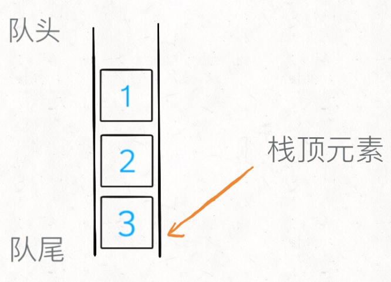


```java
import java.util.LinkedList;
import java.util.Queue;

class MyStack {
    private Queue<Integer> queue = new LinkedList<>();
    int top;
    public MyStack() {

    }
	
    //添加的时候更新top的值
    public void push(int x) {
        queue.add(x);
        top = x;
    }
	
    //注意更新top的值
    public int pop() {
        int size = queue.size();
        while (size > 2) {
            queue.add(queue.poll());
            size--;
        }
        top = queue.peek();
        queue.add(queue.poll());
        return queue.poll();
    }

    public int top() {
        return top;
    }

    public boolean empty() {
        return queue.isEmpty();
    }
}
//pop的时间复杂度是o(n)
```


## 括号问题


### 匹配问题

给定一个只包括 `'('`，`')'`，`'{'`，`'}'`，`'['`，`']'` 的字符串 `s` ，判断字符串是否有效。

单个`(` ，`)`括号匹配问题

```go
func isValid(s string) bool {
	left := 0
	for i := 0; i < len(s); i++ {
		if s[i] == '(' {
			left++
		} else {
			left--
		}
        //如果left<0那么右括号多个返回false
		if left < 0 {
			return false
		}
	}
    //查看最后左右括号抵消后是否==0
	return left == 0
}
```

当多个括号的时候能不能根据上面的情况，设置3个left进行相关的操作(可能if判断会多一些)，答案是不能的因为 `( { ) }`这样的情况是不满足的，这个时候就需要进行设计思路，需要借助栈的数据结构，首先如果是左括号那么就入栈，如果是右括号就需要进行将栈中的top进行弹出，如果匹配那么就成立，不匹配就返回false。

```java
    public boolean isValid(String s) {
        Stack<Character> stack = new Stack<>();
        HashMap<Character, Character> map = new HashMap<>();
        map.put('[',']');
        map.put('{','}');
        map.put('(',')');
        for (int i = 0; i < s.length(); i++) {
            if (map.containsKey(s.charAt(i))) {
                stack.push(s.charAt(i));
            } else {
                //需要判断栈不是空的并且弹出的需要与当前进行匹配
                if (stack.isEmpty()||map.get(stack.pop())!=s.charAt(i)) {
                    return false;
                }
            }
        }
        return stack.isEmpty();
    }
```


### 填充在最少括号补充问题

`（）`对其进行补充，成有效的括号表达式

```go
func minAddToMakeValid(s string) int {
   left := 0
   ans := 0
   for i := 0; i < len(s); i++ {
      if s[i] == '(' {
         left++
      } else {
         left--
      }
      //右括号较多，补充左括号
      if left == -1 {
         ans -= left
         left = 0
      }
   }
   //最后统计左括号较多，补充右括号
   return ans + left
}
```


## 单调栈


```java
//nextGreater当前数组下标的下一个、最近的、大于、当前的值
public int[] nextGreater(int[] nums) {
    //单调栈首先确定的是栈中弹出的元素比当前的大，为什么？并且又为什么是最近的？
    Stack<Integer> stack = new Stack<>();
    int[] ans = new int[nums.length];
    for (int i = nums.length - 1; i >= 0; i--) {
        //根据这一个我们可以看出，不比当前元素大的都被栈给丢弃了，比当前的值大确定了(栈空返回-1)
        while (!stack.isEmpty()&&nums[i]>=stack.peek()){
            //对于后面的元素来说，如果后面的元素比当前的元素较小，那么可以返回当前的元素
            //如果后面的元素比当前的元素较大，那么这些弹出来的比当前元素更小的也没有什么作用。
            stack.pop();
        }
        if (stack.isEmpty()){
            ans[i] = -1;
        }else{
            //根据栈的添加顺序可以的值返回的是最近的
            ans[i] = stack.peek();
        }
        //将当前的元素加入栈中(当前的元素比栈中的元素较小(除非栈中没有元素))
        stack.push(nums[i]);
    }
    return ans;
}
```


对于循环数组的单调队列来说，最常用的循环我们是将数组的长度扩充1倍来进行，注意可以使用取余的方式在逻辑上进行扩容，并不需要在物理上进行扩容。


### 进行元素的去重操作(想思路)

给你一个字符串 `s` ，

1. 请你去除字符串中重复的字母，使得每个字母只出现一次。
2. 要求不能打乱其他字符的相对位置。
3. 需保证 **返回结果的字典序最小**

思路分析首先考虑前两个问题，字典序最小考虑使用单调栈(想不出来。。。)，如果使用单调栈解决前两个问题代码如下：

```java
public String removeDuplicateLetters(String s) {
    Stack<Character> stack = new Stack<>();
    HashSet<Character> set = new HashSet<>();
    for (int i=0;i<s.length();i++){
        if (!set.contains(s.charAt(i))){
            stack.push(s.charAt(i));
            set.add(s.charAt(i));
        }
    }
    StringBuilder builder = new StringBuilder();
    while (!stack.isEmpty()){
        builder.append(stack.pop());
    }
    return builder.reverse().toString();
}
//仅仅是消除了后面的重复的元素，字母只出现了一次
```


使用单调栈进行思考，先push进去的元素我们希望尽可能的小(因为弹出栈后最后会进行反转操作)，所以我们希望栈最下面的元素尽可能的小，**也就是说当前如果push进去的元素如果编码集较小的话把前面的元素给挤出来**(和单调栈的思路类似)。

```java
public String removeDuplicateLetters(String s) {
    Stack<Character> stack = new Stack<>();
    HashSet<Character> set = new HashSet<>();//记录栈中存在的元素set
    for (int i = 0; i < s.length(); i++) {
        //如果栈中已经存在
        if (set.contains(s.charAt(i))) {
            continue;
        }
        //将编码集与当前相比较小的进行删除
        while (!stack.isEmpty() && s.charAt(i) < stack.peek()) {
            set.remove(stack.pop());
        }
        //添加当前字符到栈中，并标记set
        stack.push(s.charAt(i));
        set.add(s.charAt(i));
    }
    StringBuilder builder = new StringBuilder();
    while (!stack.isEmpty()) {
        builder.append(stack.pop());
    }
    return builder.reverse().toString();
}
```

但是这个代码不符合题目的要求，**分析可以得知后面的编码集较小的会将前面的字母给删除**，`"acecd"`为例`c`会将`e`删除，所以这个时候就需要进行判断什么时候可以将e给删除，如果e在后面还出现，可以删除，在后面没有出现不可以删除。所以开头需要进行数组的遍历查看每一个字母后面是否还出现。

```java
public String removeDuplicateLetters(String s) {
    //记录字符串中字符重复的个数
    int[] cnt = new int[26];
    for (int i=0;i<s.length();i++){
        cnt[s.charAt(i)-97]++;
    }
    Stack<Character> stack = new Stack<>();
    HashSet<Character> set = new HashSet<>();//记录栈中存在的元素set
    for (int i = 0; i < s.length(); i++) {
        cnt[s.charAt(i)-97]--;  //遍历完一次进行--
        //如果栈中已经存在
        if (set.contains(s.charAt(i))) {
            continue;
        }
        //将编码集与当前相比较小的进行删除,并且对于弹出来的元素来说后面还有相同的字符串才弹出
        while (!stack.isEmpty() && s.charAt(i) < stack.peek()&&cnt[stack.peek()-97]>=1) {
            set.remove(stack.pop());
        }
        //添加当前字符到栈中，并标记set
        stack.push(s.charAt(i));
        set.add(s.charAt(i));
    }
    StringBuilder builder = new StringBuilder();
    while (!stack.isEmpty()) {
        builder.append(stack.pop());
    }
    return builder.reverse().toString();
}
```


## 单调队列(滑动窗口)

```java
class MonotonicQueue {
    //对头元素是最大的，向队尾递减(可以等于)
    LinkedList<Integer> q = new LinkedList<>();

    //向队列中添加元素
    public void push(int n) {
        //为什么没有==,或者说为什么最后的元素==当前添加的元素为什么不会将最后的元素弹出
        //因为pop会根据左边的滑动窗口进行对值移除2次，如果相等的话队列中只有一次，可能会移除最优解
        //[3,1,1,3,1,1]  k==4
        while (!q.isEmpty() && n > q.getLast()) {
            q.pollLast();
        }
        q.addLast(n);
    }
    
    //获取队头元素，也就是当前最大的元素
    public int max() {
        return q.getFirst();
    }
    
    //弹出队头元素是n的值的元素
    public void pop(int n) {
        if (n == q.getFirst()) {
            q.pollFirst();
        }
    }
}
```


# 设计数据结构


## LRU算法

最近最少使用页面置换算法，想让get是o(1)那么需要HashMap来获取value，想要put是o(1)，需要更新元素，怎么样更新元素才是o(1)，需要将put的元素放到队尾，最近最少使用的元素放到队头直接进行删除。但是put需要进行将最近访问的元素放到队尾(最近访问删除会晚些)。将put的元素放到队尾需要双链表才有可能放到队尾。

大致的思路是使用HashMap在o(1)的时间内`get` `value`的值，在get的时候会将当前的key-value更新到队尾，在put的时候会将对头的元素进行删除，将put的元素放到队尾。

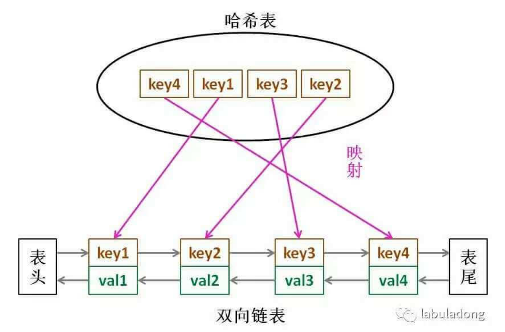


```java
    class LRUCache {
        class Node {
            int key, value;
            Node pre, next;

            Node(int key, int value) {
                this.key = key;
                this.value = value;
            }
        }

        class DoubleList {
            Node head, tail;   //记录队头与队尾节点
            int size;   //记录map容纳的长度

            DoubleList() {
                head = new Node(0, 0);
                tail = new Node(0, 0);
                head.next = tail;
                tail.pre = head;
                size = 0;
            }
			
            void removeNodeToTail(Node node) {
                //删除node节点
                node.pre.next = node.next;
                node.next.pre = node.pre;
                size--;
                addNodeToTail(node);
            }

            void addNodeToTail(Node node) {
                //将node节点移到队尾
                Node temp = tail.pre;
                temp.next = node;
                node.pre = temp;
                tail.pre = node;
                node.next = tail;
                size++;
            }

            int deleteHeadNode() {
                Node temp = head.next;
                temp.next.pre = head;
                head.next = temp.next;
                size--;
                return temp.key;
            }
        }

        //Node节点中包含key能够在删除value的时候o(1)的时间复杂度删除map中的key
        HashMap<Integer, Node> map;
        DoubleList doubleList;
        int capacity;

        public LRUCache(int capacity) {
            map = new HashMap<>();
            doubleList = new DoubleList();
            this.capacity = capacity;
        }

        //获取value并且更新将值换到队尾节点
        public int get(int key) {
            Node node = map.get(key);
            if (node == null) {
                return -1;
            }
            doubleList.removeNodeToTail(node);
            return node.value;
        }

        //将键值对插入到队尾节点
        public void put(int key, int value) {
            Node node = new Node(key, value);
            //map中已经有值进行修改value,并将key-value放到队尾
            if (map.containsKey(key)) {
                Node temp = map.get(key);
                temp.pre.next = node;
                temp.next.pre = node;
                node.pre = temp.pre;
                node.next = temp.next;
                map.put(key,node);
                doubleList.removeNodeToTail(node);
            } else {   //进行添加key-value
                if (capacity == doubleList.size) {
                    int keyHead = doubleList.deleteHeadNode();
                    map.remove(keyHead);
                }
                doubleList.addNodeToTail(node);
                map.put(key, node);
            }
        }
    }
```


分析上面的最近最久未使用的缓存算法要求

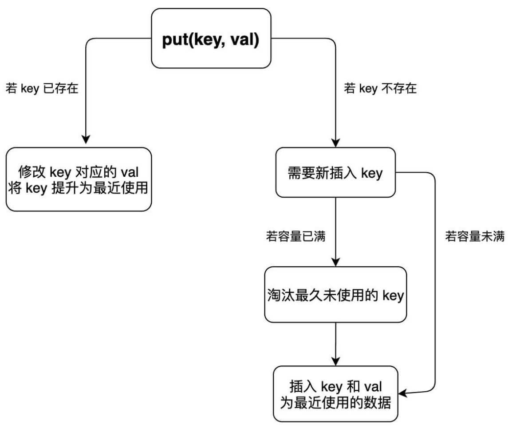

1. 首先将缓存按照顺序加入链表就代表了其使用的顺序。
2. 使用策略：当缓存被使用(hash查找到)或者添加，将缓存放到到队尾也比较自然。
3. 删除策略：删除队头的最久没有使用的(按照链表的添加顺序队头就是最久没有使用的)

使用过的缓存直接添加到队尾


## LFU算法

最不经常使用缓存算法

1. 使用策略：缓存被使用需要cnt+1
2. 删除策略：需要找到当前cnt最小的，如果cnt最小的有多个，找到最久未使用的(根据时间插入链表，返回链表的尾部)。

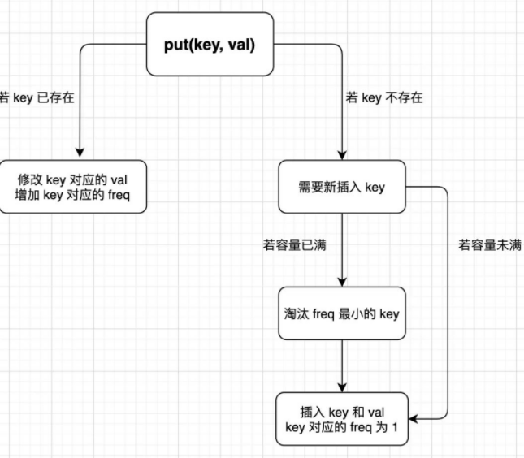


```java
//最不经常使用缓存算法，如果使用次数相同保留最近使用的
class LFUCache {
    HashMap<Integer, Integer> keyToVal;   //key-value
    //fre相同应该返回LinkedHashSet的队头元素
    HashMap<Integer, LinkedHashSet<Integer>> freToKey; //次数到key的映射表
    HashMap<Integer, Integer> keyToFre;   //key的次数(用于查找和移动freToKey)
    int capacity;
    int minFre = 0;

    public LFUCache(int capacity) {
        keyToVal = new HashMap<>();
        freToKey = new HashMap<>();
        keyToFre = new HashMap<>();
        this.capacity = capacity;
    }

    //获取当前的value，并将key的cnt++
    public int get(int key) {
        if (capacity==0){
            return -1;
        }
        if (!keyToVal.containsKey(key)){
            return -1;
        }
        changeMap(key);
        return keyToVal.get(key);
    }

    //根据key进行修改keyToFre，freToKey
    void changeMap(int key) {
        //前提是key存在keyToFre中
        int fre = keyToFre.get(key);
        //修改keyToFre
        keyToFre.put(key, fre + 1);
        //删除fre中的key
        LinkedHashSet<Integer> freKeys = freToKey.get(fre);
        freKeys.remove(key);
        if (freKeys.isEmpty()){  //如果fre里面没有key那么删除
            freToKey.remove(fre);
            if (minFre == fre){  //如果删除的是最小的那么minFre++
                minFre++;
            }
        }
        //添加fre+1中的key
        if (!freToKey.containsKey(fre + 1)) {//如果没有fre+1这个需要添加
            freToKey.put(fre + 1, new LinkedHashSet<>());
        }
        LinkedHashSet<Integer> keys = freToKey.get(fre + 1);
        keys.add(key);
    }

    //缓存页面添加操作
    void add(int key,int value){
        //添加key-value
        keyToVal.put(key, value);
        //添加key-fre
        keyToFre.put(key,1);
        //添加fre-key
        if (freToKey.containsKey(1)){
            LinkedHashSet<Integer> keys = freToKey.get(1);
            keys.add(key);
        }else {
            LinkedHashSet<Integer> keys = new LinkedHashSet<>();
            keys.add(key);
            freToKey.put(1,keys);
        }
        //将最小值设置为1
        minFre = 1;
    }

    public void put(int key, int value) {
        //如果在缓存中需要进行keyToFre和freToKey的更新
        if (keyToVal.containsKey(key)) {
            keyToVal.put(key,value);
            changeMap(key);
        } else {//如果不在缓存中，需要进行查看key-value的容量与capacity对应关系
            keyToVal.put(key,value);
            if (keyToVal.size() <= capacity) {//当前缓存没有man
                //添加key—value，添加key-fre，查看fre-key是否有当前的fre
                add(key,value);
            } else {  //当前缓存已满需要进行删除某个节点在添加此节点
                LinkedHashSet<Integer> keys = freToKey.get(minFre);
                //根据minFre进行删除key
                Integer next = keys.iterator().next();  //获取当前删除的key
                //根据key修改key-value、fre-key、key-fre
                keyToVal.remove(next);
                keyToFre.remove(next);
                keys.remove(next);
                //添加key—value，添加key-fre，查看fre-key是否有当前的fre
                add(key,value);
            }
        }
    }
}
```


## O(1) 时间插入、删除和获取随机元素


获取随机元素在底层上必须使用连续的数组，才能够使用rand进行等概率查询。

```java
class RandomizedSet {
    //底层数组用于随机化查找
    ArrayList<Integer> arr;
    //用于查找集合中是否有元素，以及元素对应的数组的位置，便于删除元素
    HashMap<Integer,Integer> map;
    Random random = new Random();

    public RandomizedSet() {
        arr = new ArrayList<>();
        map = new HashMap<>();
    }

    //当元素不存在时向数组集合末尾插入该项
    public boolean insert(int val) {
        if (map.containsKey(val)){
            return false;
        }
        int size = arr.size();
        arr.add(val);
        map.put(val,size);
        return true;
    }

    //当元素存在时移除该项
    public boolean remove(int val) {
        if (!map.containsKey(val)){
            return false;
        }
        //需要删除元素的下标
        Integer pos = map.get(val);
        Integer last = arr.get(arr.size() - 1);
        //修改链表元素pos位置值为change
        arr.set(pos,last);
        arr.remove(arr.size()-1);
        map.put(last,pos);
        map.remove(val);
        return true;
    }

    //随机获取集合中的元素
    public int getRandom() {
        return arr.get(random.nextInt(arr.size()));
    }
}
```


黑名单与白名单对应关系

```java
class Solution {
    HashMap<Integer, Integer> map = new HashMap<>();
    int cap;
    Random random = new Random();

    //数组中blacklist代表的是黑名单的列表，将黑名单逻辑上移动到数组的后面
    public Solution(int n, int[] blacklist) {
        cap = n - blacklist.length; //[0,cap-1]  [cap,n-1]是需要进行映射的地方
        int value = cap;
        //先将黑名单加入map中
        for (int i=0;i< blacklist.length;i++){
            map.put(blacklist[i],blacklist[i]);
        }
        for (int i=0;i< blacklist.length;i++){
            if (blacklist[i]>=cap){
                continue;
            }
            //如果黑名单对应的值包含在黑名单中，那么value++,并且i不能后移
            if (map.containsKey(value)){
                value++;
                i--;
                continue;
            }
            //黑名单对应的value不在黑名单中直接放入map中
            map.put(blacklist[i],value);
            value++;
        }
    }

    public int .pick() {
        int i = random.nextInt(cap);
        if (map.containsKey(i)){
            return map.get(i);
        }
        return i;
    }
}
```


## 划分元素选取中位数

对于选取中位数的情况，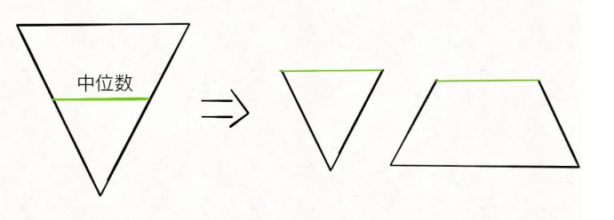

使用倒三角来表示数据大小从底部到顶部越来越大，分析：对于数据我们需要对半分开，需要使用两个优先队列，对于相对小的数我们需要内部数据最大的在优先队列前面，对于数据较大的我们需要内部数据较小的在优先队列的前面，如果两个优先队列的长度相等，那么直接返回两个优先队列的第一个的平均值，两个优先队列需要维护长度之差在1范围内，如果接连两个数值添加到某个队列中，需要将这个队列的第一个数据添加到另一个队列。


```java
//对于选取中位数
class MedianFinder {
    PriorityQueue<Integer> max;  //较大数据，小数据在前面
    PriorityQueue<Integer> min;  //较小数据，大数据在前面

    public MedianFinder() {
        max = new PriorityQueue<>(new Comparator<Integer>() {
            @Override
            public int compare(Integer o1, Integer o2) {
                return o1 - o2;
            }
        });
        min = new PriorityQueue<>(new Comparator<Integer>() {
            @Override
            public int compare(Integer o1, Integer o2) {
                return o2 - o1;
            }
        });
    }

    public void addNum(int num) {
        //如果没有元素添加到min中，将元素添加到多的一边
        //即使是添加的元素地方不对，也会根据下面的弹出元素进行重新正确
        if (min.size() >= max.size()) {
            min.offer(num);
            max.offer(min.poll());
        } else {
            max.offer(num);
            min.offer(max.poll());
        }
    }

    public double findMedian() {
        //如果两个队列长度相等，返回两个队列头部的平均值，否则返回长的队列的头部
        if (min.size()==max.size()){
            return ((double)min.peek()+(double)max.peek())/2;
        }else if (max.size()>min.size()){
            return (double) max.peek();
        }else {
            return (double) min.peek();
        }
    }
}
```


# 树与递归

写树相关的算法，简单说就是，先搞清楚**当前 root 节点「该做什么」以及「什么时候做」**，然后根据函数定义递归调⽤⼦节点，递归调⽤会让孩⼦节点做相同的事情。 

1. 所谓「该做什么」就是让你想清楚写什么代码能够实现题⽬想要的效果
2. 所谓「什么时候做」，就是让你思考这段代码到底应该写在前序、中序还是后序遍历的代码位置上。


## 前缀树

```go
type Trie struct {
	children [26]*Trie //下标代表26个英文字母
	isEnd    bool      //是否以该节点为结尾的单词
}

func Constructor() Trie {
	return Trie{}
}

func (t *Trie) Insert(word string) {
	node := t
	for _, ch := range word { //遍历每一个单词的字符串
		ch -= 'a'
		if node.children[ch] == nil { //查看是否有以该单词为其实的字符，如果没有进行创建
			node.children[ch] = &Trie{}
		}
		node = node.children[ch] //继续递归的使node指向孩子，继续设置字符串的孩子
	}
	node.isEnd = true //以该节点结尾的单词设置为true
}

func (t *Trie) SearchPrefix(prefix string) *Trie { //查找是否有当前字符串的前缀
	node := t
	for _, ch := range prefix {
		ch -= 'a'
		if node.children[ch] == nil {
			return nil
		}
		node = node.children[ch]
	}
	return node
}

func (t *Trie) Search(word string) bool { //查找有当前的前缀并且end是true
	node := t.SearchPrefix(word)
	return node != nil && node.isEnd
}

func (t *Trie) StartsWith(prefix string) bool {
	return t.SearchPrefix(prefix) != nil
}
```


## 树交换左右节点

```go
//做什么：反转左右节点的链表
//什么时候做：前序遍历的时候做
func invertTree(root *TreeNode) *TreeNode {
    //当前节点是空的或者左右节点都是空的也可以直接返回(递归出口)
	if root == nil || (root.Left == nil && root.Right == nil) {
		return root
	}
	//交换节点
	root.Left, root.Right = root.Right, root.Left
    //进行递归
	invertTree(root.Left)
	invertTree(root.Right)
	return root
}
```

思考上面的代码放到前序后序上面都可以为什么？放到中序上可以吗？

- 递归出口：我们想一下递归出口是没有错的，当前根是空的或者是左右节点是空的直接返回，(当然仅仅写当前根是空的也是可以的，无非就是左右节点是空的时候交换两个空的而已)。
- 然后思考交换节点的地方，放在前序遍历上直接交换当前根节点的左右子树，没有什么问题
- 如果放在后序上面按照我的思路应该是，**先递归下去找到接近递归出口的地方进行下一次递归**

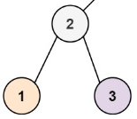

如上面的树，当前的递归到2的时候，会递归左节点，发现1的左右节点都是空的直接返回，然后递归右节点，发现3的左右节点都是空的直接返回，交换1和3节点并没有什么错误

- 如果放在中序上：当前递归到2的时候，递归左节点，发现1的左右节点空返回，**这个时候交换左右子树**会将1和3进行交换，然后递归右节点这个时候右节点是1(已经交换完毕的)，


## 层序遍历/双节点递归

填充节点的next指针，使next指针指向右面的节点。（满二叉树）

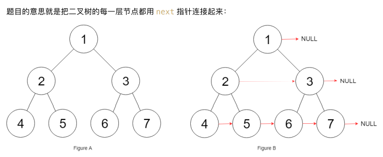

这个时候可以使用层序遍历。

```java
    public Node connect(Node root) {
        Queue<Node> nodes = new LinkedList<>();
        nodes.offer(root);
        while (!nodes.isEmpty()) {
            int size = nodes.size();
            //层序遍历
            for (int i = 0; i < size; i++) {
                Node poll = nodes.poll();
                if (i == size - 1) {//如果是当前层的最后一个那么右指针是空的
                    poll.next = null;
                }else {
                    poll.next = nodes.peek();
                }
                //拓展左右节点
                if (poll.left!=null){
                    nodes.offer(poll.left);
                }
                if (poll.right!=null){
                    nodes.offer(poll.right);
                }
            }
        }
        return root;
    }
```


**思考这个时候怎么样才能使用递归**，想一想之前的递归，在一个节点的情况下，如下面的树

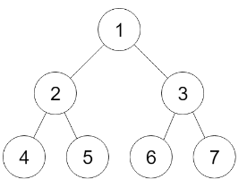

比如说当前的节点`root = 2`节点，那么我只能让2的左节点4指向右节点5，没有办法获取节点3的左节点，让节点5指向节点6。

这个时候仅仅使用一个root节点作为函数的传入的节点是不够的，函数的传入节点应该是当前节点的左右节点，这个时候才有可能让左节点的右孩子指向右节点的左孩子。

```go
//完全二叉树
func connect(root *Node) *Node {
	if root == nil {
		return root
	}
	connectDouble(root.Left, root.Right)
	return root
}

func connectDouble(left, right *Node) {
    //左节点是空的直接返回
	if left == nil {
		return
	}
	left.Next = right
    //左节点左孩子指向左节点右孩子
	connectDouble(left.Left, left.Right)
    //左节点右孩子指向右节点左孩子
	connectDouble(left.Right, right.Left)
    //右节点左孩子指向右节点右孩子
	connectDouble(right.Left, right.Right)
}
```


## 二叉树按照前序遍历展开

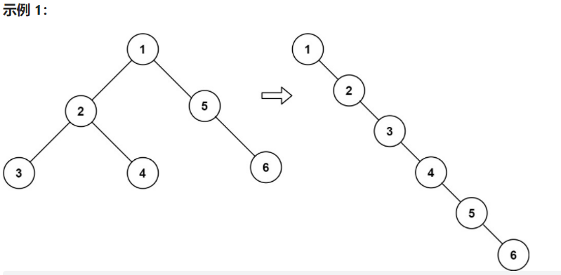


```go
func flatten(root *TreeNode) {
	if root == nil {
		return
	}
	flatten(root.Left)
	flatten(root.Right)
	//暂存当前root的右节点
	temp := root.Right
	//左子树赋值给右子树
	root.Right = root.Left
	lr := root
	root.Left = nil
	//已经将左子树赋值给右子树了(如果左子树是空的右子树可以直接赋值到根节点上面)
	//直接一直向右遍历找到最右面
	for lr.Right != nil {
		lr = lr.Right
	}
	lr.Right = temp
}
```


## 根据数组构架二叉树


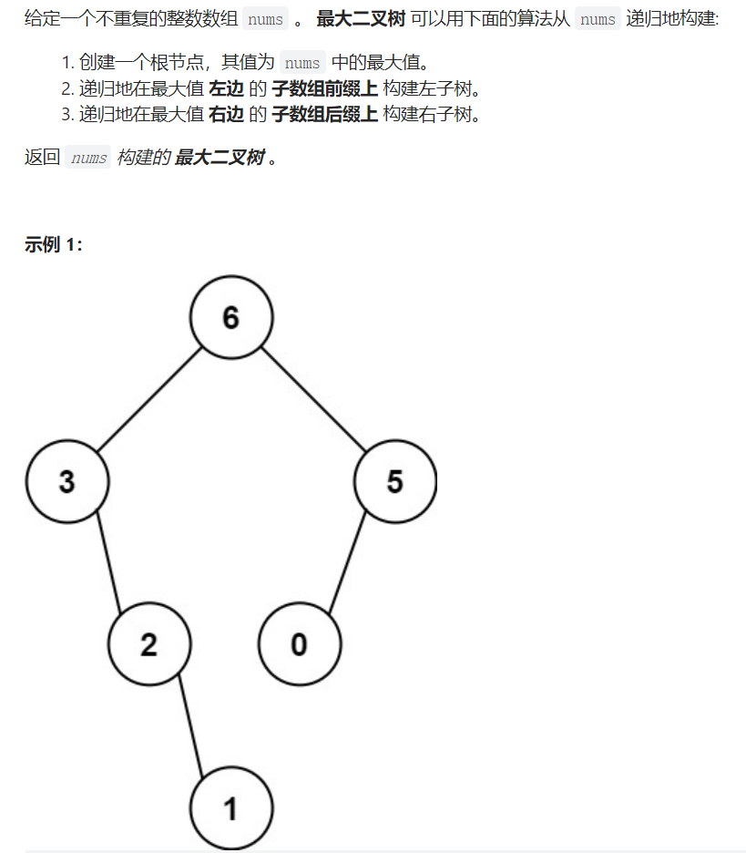

```go
func constructMaximumBinaryTree(nums []int) *TreeNode {
	return leftRightRoot(nums, 0, len(nums)-1)
}

//根据当前的数组nums的l和r中的范围来确定当前的根节点
func leftRightRoot(nums []int, l, r int) *TreeNode {
    if l > r {
		return nil
	}
	mid := maxPos(nums, l, r)
	root := &TreeNode{nums[mid], nil, nil}
	root.Left = leftRightRoot(nums, l, mid-1)
	root.Right = leftRightRoot(nums, mid+1, r)
	return root
}

//获取最大值的数组下标位置
func maxPos(nums []int, l, r int) int {
	pos := l
	for i := l; i <= r; i++ {
		if nums[i] > nums[pos] {
			pos = i
		}
	}
	return pos
}
```


## 根据前序、后序和中序构建二叉树

```go
func buildTree(preorder []int, inorder []int) *TreeNode {
	return build(preorder, inorder, 0, 0, len(preorder)-1)
}

func build(preorder, inorder []int, cnt int, l, r int) *TreeNode {
	if cnt == len(preorder) || l > r {
		return nil
	}
	//在inorder[l,r]查找值是preorder[cnt]的下标
	mid := findValue(inorder, preorder[cnt], l, r)
	root := &TreeNode{preorder[cnt], nil, nil}
	//左节点的前序位置总是cnt下一个
	root.Left = build(preorder, inorder, cnt+1, l, mid-1)
	//右节点的前序位置是当前cnt的位置的加上左子树节点的位置
	root.Right = build(preorder, inorder, cnt+mid+1-l, mid+1, r)
	return root
}

//根据数组nums的范围l，r来查找target，并返回数组的下标
func findValue(nums []int, target, l, r int) int {
	pos := -1
	for i := l; i <= r; i++ {
		if nums[i] == target {
			pos = i
			return pos
		}
	}
	return pos
}
```


```go
//根据后序遍历查找根节点
func build(postorder, inorder []int, cnt int, l, r int) *TreeNode {
	if cnt == len(postorder) || l > r {
		return nil
	}
	//在inorder[l,r]查找值是preorder[cnt]的下标
	mid := findValue(inorder, postorder[cnt], l, r)
	root := &TreeNode{postorder[cnt], nil, nil}
	//左节点的前序位置总是cnt下一个
	root.Left = build(postorder, inorder, cnt-(r-mid)-1, l, mid-1)
	//右节点的前序位置是当前cnt的位置的加上左子树节点的位置
	root.Right = build(postorder, inorder, cnt-1, mid+1, r)
	return root
}

//根据数组nums的范围l，r来查找target，并返回数组的下标
func findValue(nums []int, target, l, r int) int {
	pos := -1
	for i := l; i <= r; i++ {
		if nums[i] == target {
			pos = i
			return pos
		}
	}
	return pos
}

func buildTree(inorder []int, postorder []int) *TreeNode {
	return build(postorder, inorder, len(postorder)-1, 0, len(postorder)-1)
}
```


## 二叉树的序列化

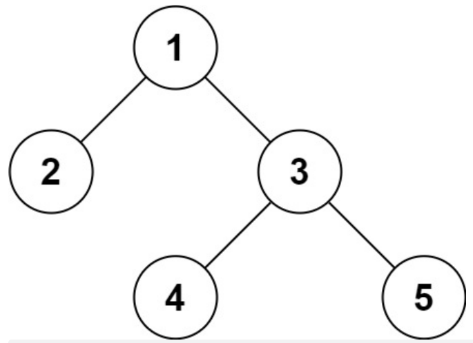


### 层序序列化

"1,2,3,#,#,4,5,#,#,#,#"  与上面的树形成对应

```java
    // Encodes a tree to a single string.
    public String serialize(TreeNode root) {
        if (root == null) {
            return "";
        }
        Queue<TreeNode> queue = new LinkedList<>();
        StringBuilder builder = new StringBuilder();
        queue.add(root);
        while (!queue.isEmpty()) {
            TreeNode node = queue.poll();
            if (node == null) {
                builder.append("#").append(",");
                continue;
            }
            builder.append(node.val).append(",");
            queue.offer(node.left);
            queue.offer(node.right);
        }
        return builder.toString();
    }

    // Decodes your encoded data to tree.
    public TreeNode deserialize(String data) {
        if (data.equals("")) {
            return null;
        }
        String[] strings = data.split(",");
        TreeNode root = new TreeNode(Integer.parseInt(strings[0]));
        Queue<TreeNode> queue = new LinkedList<>();
        queue.offer(root);
        for (int i = 1; i < strings.length; i++) {
            TreeNode node = queue.poll();   //当前弹出的需要赋值左右节点
            if (strings[i].charAt(0) != '#') {
                node.left = new TreeNode(Integer.parseInt(strings[i]));
                queue.offer(node.left);
            }
            i++;
            if (strings[i].charAt(0) != '#') {
                node.right = new TreeNode(Integer.parseInt(strings[i]));
                queue.offer(node.right);
            }
        }
        return root;
    }
```


### 先序序列化

**注：如果数组可以模拟队列，添加元素append，删除元素date = date[1:]，同理模拟栈添加元素append，删除栈顶元素date = date[:len(date)-2]**

```go
type Codec struct {
}

func Constructor() Codec {
	return Codec{}
}

// Serializes a tree to a single string.
func (this *Codec) serialize(root *TreeNode) string {
	if root == nil {
		return "#,"
	}
	var s string
	//加上根节点
	s += strconv.Itoa(root.Val) + ","
	//加上左右节点
	s += this.serialize(root.Left)
	s += this.serialize(root.Right)
	return s
}

// Deserializes your encoded data to tree.
func (this *Codec) deserialize(data string) *TreeNode {
	sp := strings.Split(data, ",")
	var build func() *TreeNode
	build = func() *TreeNode {
		if sp[0] == "#" {
			sp = sp[1:]
			return nil
		}
		val, _ := strconv.Atoi(sp[0])
		sp = sp[1:]
		root:=&TreeNode{val,nil,nil}
		root.Left = build()
		root.Right = build()
		return root
	}
	return build()
}
```


## 寻找重复的子树

给定一棵二叉树 root，返回所有重复的子树。

对于同一类的重复子树，你只需要返回其中任意一棵的根结点即可。

如果两棵树具有相同的结构和相同的结点值，则它们是重复的。

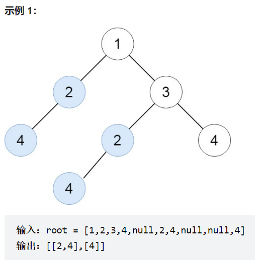


首先为每一个节点建立当前节点为根的树的序列化，然后建立map对应如果存在就++，找出map的string的值是2的情况在使用反序列化出重复出现的子树。


## 后序遍历的使用

[1373. 二叉搜索子树的最大键值和](https://leetcode-cn.com/problems/maximum-sum-bst-in-binary-tree/)

注意此算法的思想，当前root节点的判断是否是二叉搜索树，需要已知的左右节点的子树是否是二叉搜索树，所以需要用到后序遍历。

**注意在寻找最大值的时候应该使用标记为进行标记，也就是说每一次可能大于max标记的情况下都需要比较一下进行赋值，而不是想着遍历完函数直接返回最大值(这样可能会漏掉一些可能的情况)。**

在比较左面最大值与右面最小值的时候，需要注意。


## 二叉搜索树

### 查找

```go
//查找某个值为val的节点，返回该节点
func searchBST(root *TreeNode, val int) *TreeNode {
   if root == nil {
      return root
   }
   if root.Val < val {
      //注意此处的代码，向右查找不断地递归到else的语句，然后会不断的返回。
      return searchBST(root.Right, val)
   } else if root.Val > val {
      return searchBST(root.Left, val)
   } else {
      return root
   }
}
```


### 验证

判断一棵树是否是一棵二叉搜索树，可以使用先序，每一次根节点需要进行一次比较查看是否符合要求，比较完毕之后需要更新限制的语句

```go
func isValidBST(root *TreeNode) bool {
   var isBST func(root, min, max *TreeNode) bool
    
   isBST = func(root, min, max *TreeNode) bool {
      if root == nil {
         return true
      }
      //查看当前的递归进行的根节点是否符合
      if (min != nil && root.Val <= min.Val) || (max != nil && root.Val >= max.Val) {
         return false
      }
      //进行左子树以及右子树的限制并判断
      return isBST(root.Left, min, root) && isBST(root.Right, root, max)
   }
    
   return isBST(root, nil, nil)
}
```


### 删除

删除某个节点需要注意，如果删除的节点没有左右子树，那么可以直接删除，如果只有右子树或者左子树，可以让右子树或者左子树代替当前节点，如果左右子树都存在，那么对于这题考虑的是让左子树的最右面的节点代替当前需要删除的节点，**注意是值的替换(在本代码中)**，并注意使用追踪父节点左子树最右面便于删除替换的节点。

```go
//删除二叉树中的节点
func deleteNode(root *TreeNode, key int) *TreeNode {
	if root == nil {
		return nil
	}
	//当前的节点大于key需要向左子树查找
	if root.Val > key {
		root.Left = deleteNode(root.Left, key)
	} else if root.Val < key { //如果key大于当前节点向右子树查找
		root.Right = deleteNode(root.Right, key)
	} else { //当前节点与key相等,查看当前节点是否有左右子树
		//左节点是空右节点不是空
		if root.Left == nil {
			return root.Right
		}
		if root.Right == nil {
			return root.Left
		}
		//左右节点都不是空的情况
		l := root.Left //找左节点最右面
		for l.Right != nil {
			l = l.Right
		}
		root.Val = l.Val
		//递归的删除左子树最右面的节点
		root.Left = deleteNode(root.Left, l.Val)
	}
	return root
}
```


### 插入

```go
func insertIntoBST(root *TreeNode, val int) *TreeNode {
   if root == nil {
      return &TreeNode{val, nil, nil}
   }
   if root.Val > val {
      root.Left = insertIntoBST(root.Left, val)
   } else {
      root.Right = insertIntoBST(root.Right, val)
   }
   return root
}
```


### 构建(重点)

1-n构建二叉搜索树

分析每个节点应该做什么，首先应该确定1-n都有可能是根节点，假设当前的i是根节点，那么以当前的i为根节点递归的构造左右子树左子树是1到i-1，右子树是i+1到n，这是每个节点应该做的。

但是再分析的时候需要明白的是应该采用什么序列，**这个时候就需要确定左右子树可能构造出来的个数**，需要确定左右子树能够构造出多少个树，然后加上根节点。如果是先序的话确定不了以当前节点为根的子树应该有多少个。

```go
func generateTrees(n int) []*TreeNode {
   if n == 0 {
      return make([]*TreeNode, 0)
   }
   return build(1, n)
}

func build(lo, hi int) []*TreeNode {
   arr := make([]*TreeNode, 0)
   if lo > hi {
      arr = append(arr, nil)
      return arr
   }
   for i := lo; i <= hi; i++ {
      lt := build(lo, i-1)
      rt := build(i+1, hi)
      for j := 0; j < len(lt); j++ {
         for k := 0; k < len(rt); k++ {
            root := &TreeNode{i, lt[j], rt[k]}
            arr = append(arr, root)
         }
      }
   }
   return arr
}
```


# 图算法


## 邻接表遍历(无环)

以邻接表的形式，从下标0开始遍历图的所有路径，将遍历的路径记录到ans中

```go
//graph = [[4,3,1],[3,2,4],[3],[4],[]]

func allPathsSourceTarget(graph [][]int) [][]int {
	ans := make([][]int, 0)
	cur := make([]int, 0) //记录当前深搜的栈
	cur = append(cur, 0)  //添加起始节点
	var dfs func()
	dfs = func() {
		pre := cur[len(cur)-1]   //获取前一个结点的
		if len(graph[pre]) == 0 { //如果前一个结点没有出边直接返回
			//切片是指针底层共享数组，需要拷贝一份cur到ans
			to := make([]int, len(cur))
			copy(to, cur)
			ans = append(ans, to)
			return
		}
		for i := 0; i < len(graph[pre]); i++ { //获取前一个结点的出边条数
			cur = append(cur, graph[pre][i])
			dfs()
			cur = cur[:len(cur)-1] //删除之前添加的节点
		}
	}
	dfs()
	return ans
}
```


## 判断图是否有环


### BFS

思想将图的使用邻接表数组形式存储，记录节点的入度情况，首先将入度为0的节点添加到队列中，然后遍历入度为0的节点的出边，对入度数组进行`--`操作，如果减后操作为0添加进去queue，queue弹出的顺序就是ans拓扑排序。

```go
//根据边pre数组的信息情况,查看图中是否有环(共有0--numCourses个节点)
func canFinish(numCourses int, prerequisites [][]int) bool {
	graph := make([][]int, numCourses)
	indu := make([]int, numCourses) //入度节点
	for i := 0; i < len(prerequisites); i++ {
		graph[prerequisites[i][0]] = append(graph[prerequisites[i][0]], prerequisites[i][1])
		indu[prerequisites[i][1]]++
	}
	ans := make([]int, 0)
	queue := make([]int, 0)
	//将一个入度为0的节点添加到队列中
	for i := 0; i < numCourses; i++ {
		if indu[i] == 0 {
			queue = append(queue, i)
		}
	}
	//队列不能是空
	for len(queue) != 0 {
		poll := queue[0] //出队
		queue = queue[1:]
		ans = append(ans, poll) //将弹出的队列加入到ans中
		for _, to := range graph[poll] {
			indu[to]--
			if indu[to] == 0 {
				queue = append(queue, to)
			}
		}
	}
	fmt.Println(ans)
	return numCourses == len(ans)
}

```


### DFS

**对当前的代码进行查看，进行优化。**主要的思路是递归每一个节点的所有的边判断该节点开始的所有边是否构成环。缺点可能会发生重复的遍历，比如说当前开始节点是1，然后到2，此时以节点1开始的边会将节点2开始的边给判断完毕，回溯后，还会判断节点2的情况。

```go
//根据边pre数组的信息情况,查看图中是否有环(共有0--numCourses个节点)
func canFinish(numCourses int, prerequisites [][]int) bool {
   var hasCir bool
   //根据pre数组建立邻接表
   graph := make([][]int, numCourses)
   for i := 0; i < len(prerequisites); i++ {
      from := prerequisites[i][0]
      to := prerequisites[i][1]
      graph[from] = append(graph[from], to)
   }
   vis := make([]bool, numCourses)
   var dfs func(from int)
   dfs = func(from int) {
      //设置当前节点正在被访问
      vis[from] = true
      //根据当前节点能够到达的节点继续向下遍历
      for i := 0; i < len(graph[from]); i++ {
         to := graph[from][i]
         if !vis[to] {
            dfs(to)
            if hasCir {
               return
            }
         } else {
            hasCir = true
            return
         }
      }
      vis[from] = false
   }
   for i := 0; i < numCourses; i++ {
      dfs(i)
   }
   return !hasCir
}
```

		//代码执行到此处的时候
		//首先当前节点后面可能没有节点，那么将该节点设置成已经访问完毕的状态并且将该节点加入栈中
		//或者是访问完当前节点后面的所有节点后返回到当前节点(且后面的节点没有构成环)后面的节点肯定都放问过了
		//将当前节点设置为已经访问完的状态

上述代码优化，首先将节点的状态设置成三种

- 正在访问的状态为 1
- 还没有访问的状态 0 
- 已经访问完毕的状态(代表已经访问完当前节点的所有子节点，能够返回代表以当前节点开始时没有环)将状态设置为2

我们将已经访问完毕的状态设置成2，也就是递归回溯的状态，这样如果说节点1的下一个节点是2，当节点2没有构成环，也就是说回溯后vis[2]==2，如果4节点后面也是2这个时候会发现vis[to]=2（2节点的状态时2(已经访问完毕)），这个时候就不需要进行重新的再一次递归进行判断求解。

查找当前的图是否构成了环如果没有环输出拓扑排序，如果有环输出空

```go
func findOrder(numCourses int, prerequisites [][]int) []int {
	var hasCycle = true
	ans := make([]int, 0)
	vis := make([]int, numCourses)
	graph := make([][]int, numCourses)
	for i := 0; i < len(prerequisites); i++ {
		graph[prerequisites[i][0]] = append(graph[prerequisites[i][0]], prerequisites[i][1])
	}
	var traverse func(from int)
	traverse = func(from int) {
		//将from节点设置为正在访问中
		vis[from] = 1
		for _, to := range graph[from] {
			if vis[to] == 0 { //如果下一个节点没有被访问向下继续访问
				traverse(to)
				if !hasCycle { //如果已经成环返回
					return
				}
			} else if vis[to] == 1 { //如果下一个节点正在访问中说明已经成为了环
				hasCycle = false
				return
			}
		}

		vis[from] = 2
		ans = append(ans, from)
	}
	for i := 0; i < numCourses && hasCycle; i++ {
		if vis[i] == 0 {
			traverse(i)
		}
	}
	if !hasCycle {
		return make([]int, 0)
	}
	return ans
}
```

注意：判断图中是否有环，根据所有的节点调用上面的方程，has0方法中，应该使用一个变量进行标记下当前的图中是否有环，**不可以直接进行函数返回bool类型的值进行直接判断，因为如果直接使用返回的话图的递归边取消的回溯就执行不了了，**算法有误。


## 二分图

使用两种颜色，看看能不能将每一条边的节点使用不同的颜色进行染。最后两种颜色是否能够满足。

### dfs

```go
func isBipartite(graph [][]int) bool {
	var pan bool
	vis := make([]bool, len(graph))
	//使用两种颜色进行对节点染色
	color := make([]bool, len(graph))
	var dfs func(cur int)
	dfs = func(cur int) {
		if pan == true { //不符合二分图不用继续
			return
		}
		vis[cur] = true
		for _, to := range graph[cur] {
			if vis[to] { //当前to节点已经被访问了
				if color[to] == color[cur] {
					pan = true
					return
				}
			} else { //当前节点没有被访问
				//设置与from节点相反的颜色
				color[to] = !color[cur]
				//继续向下查找
				dfs(to)
			}
		}
	}

	//图可能不是连通的
	for i := 0; i < len(graph) && !pan; i++ {
		if !vis[i] { //当前的i没有被访问执行深搜
			dfs(i)
		}
	}
	return !pan
}
```


### bfs

```go
func isBipartite(graph [][]int) bool {
   var pan bool
   vis := make([]bool, len(graph))
   //使用两种颜色进行对节点染色
   color := make([]bool, len(graph))
   queue := make([]int, 0)
   var bfs func(from int)
   bfs = func(from int) {
      queue = append(queue, from)
      vis[from] = true
      for len(queue) != 0 {
         poll := queue[0]
         queue = queue[1:]
         for _, to := range graph[poll] {
            if !vis[to] { //如果出边没有被访问，将其设置为访问过的状态，并且设置和from相反的颜色
               vis[to] = true
               color[to] = !color[poll]
               queue = append(queue, to)
            } else { //如果出边已经被访问那么对比出边与当前节点是否一直
               if color[poll] == color[to] {
                  pan = true
                  return
               }
            }
         }
      }

   }
   //对每一个节点进行bfs搜索，因为图可能是不连通的状态
   for i := 0; i < len(graph); i++ {
      if !vis[i] {
         bfs(i)
      }
   }
   return !pan
}
```


## 欧拉问题

给定一个 `n` 个点 `m` 条边的图，要求从指定的顶点出发，经过所有的边恰好一次（可以理解为给定起点的「一笔画」问题）。

欧拉的相关定义：

- 通过图中所有边恰好一次且行遍所有顶点的通路称为欧拉通路；

- 通过图中所有边恰好一次且行遍所有顶点的回路称为欧拉回路；
- 具有欧拉回路的无向图称为欧拉图；
- 具有欧拉通路但不具有欧拉回路的无向图称为半欧拉图。

leetcode 332

给你一份航线列表 tickets ，其中 tickets[i] = [fromi, toi] 表示飞机出发和降落的机场地点。请你对该行程进行重新规划排序。所有这些机票都属于一个从 JFK（肯尼迪国际机场）出发的先生，所以该行程必须从 JFK 开始。如果存在多种有效的行程，请你按字典排序返回最小的行程组合。例如，行程 ["JFK", "LGA"] 与 ["JFK", "LGB"] 相比就更小，排序更靠前。假定所有机票至少存在一种合理的行程。且所有的机票 必须都用一次 且 只能用一次。

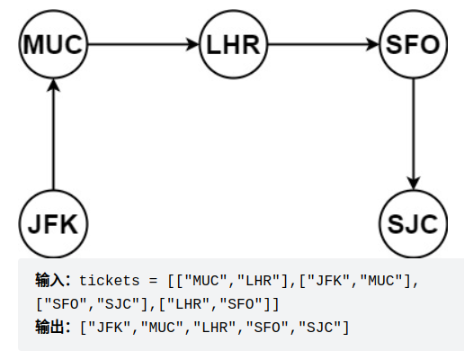

https://leetcode.cn/problems/reconstruct-itinerary/

根据上面的情况可以发现所有的机票必须使用一次，那么可以发现必须要经过所有的边，并且需要从指定的位置出发。

首先是判断当前的图是否是欧拉图：

- 如果无向图G，是连通的且没有奇度顶点，是欧拉图

- 如果无向图G，是连通的且G中的有0个或者2个奇度顶点，是半欧拉图，其中一个是开始一个是最后节点

- 对于有向图 G，G 是欧拉图当且仅当 G的所有顶点属于同一个强连通分量且每个顶点的入度和出度相同。

- 对于有向图 G，G 是半欧拉图当且仅当

1. 如果将 G 中的所有有向边退化为无向边时，那么 G 的所有顶点属于同一个强连通分量；
2. 最多只有一个顶点的出度与入度差为 1；出度大的是开始的节点
3. 最多只有一个顶点的入度与出度差为 1；入度大的是结束的节点
4. 所有其他顶点的入度和出度相同。

根据当前的题进行分析可以得到信息存在上面的路径使得当前的图至少是一个半欧拉图。

首先我们应该先建立邻接表来表示一张图，from-->to 对于to我们可以先进行排序，

确定什么才是死胡同的点，入度比出度大于1的时候是死胡同，进去了就出不来了。

```go
func findItinerary(tickets [][]string) []string {
    //核心思想，在半欧拉图中对于开的节点和结束的节点，来说开始的节点是出度大于入度，结束的节点是入度大于出度
    //当然对于欧拉图就是所有的节点出度等于入度。
    //无论我们中间是怎么走，我们都会最终的节点是没有出边可以走的节点，我们会将没有出边可以走的当前节点添加到栈中
    //对于按照字典序来进行输出这一方面我们来看，我们先走的是字典序较低的一部分那么边回走的时候就会发现
    //添加到栈中的是字典序较高的那部分，字典序低的在栈的后面，符合我们的期望
    m := make(map[string][]string)
    res := make([]string,0)
    
    for _, ticket := range tickets {
        src, dst := ticket[0], ticket[1]
        m[src] = append(m[src], dst)
    }
    for key := range m {
        sort.Strings(m[key])
    }
    var dfs func(curr string)
    dfs = func(curr string) {
        for {
            //代表当前节点没有路径可以走了，跳出循环将当前的curr节点添加到栈中
            if v, ok := m[curr]; !ok || len(v) == 0 { 
                break
            }
            tmp := m[curr][0]
            m[curr] = m[curr][1:]
            dfs(tmp)
        }
        res = append(res, curr)
    }

    dfs("JFK")
    for i := 0; i < len(res)/2; i++ {
        res[i], res[len(res) - 1 - i] = res[len(res) - 1 - i], res[i]
    }
    return res
}
```


## 并查集

**注意范围**

有时候需要在二维数组进行投影到一维数组，`(x , y) --->  x * m + y`，其中m代表的是每一行的个数。


```go
var cnt int
//根据输入的无向边返回最大连通分量,输入的edge编号0到n-1
func maximum(n int, edge [][]int) int {
   cnt = n
   father := initFather(n)
   for i := 0; i < len(edge); i++ {
      union(edge[i][0], edge[i][1], father)
   }
   return cnt
}

func union(x, y int, father []int) {
   fx := find(x, father)
   fy := find(y, father)
   if fx != fy {
      cnt--
      father[fy] = fx
   }
}

func find(x int, father []int) int {
   for father[x] != x {
      father[x] = father[father[x]]
      x = father[x]
   }
   return x
}

func initFather(n int) []int {
   arr := make([]int, n)
   for i := 0; i < n; i++ {
      arr[i] = i
   }
   return arr
}
```


## 最小生成树

### Kruskal 算法

```go
// minimumCost 最小生成树n是节点个数
// edge[i][0]到edge[i][1]的无向边,edge[i][2]是边的代价
func minimumCost(n int, edge [][]int) int {
   sort.Slice(edge, func(i, j int) bool {
      return edge[i][2] < edge[j][2] //按照每行的第三个元素排序
   })
   cost := 0
   father := initFather(n)
   for i := 0; i < len(edge); i++ {
      if union(edge[i][0], edge[i][1], father) {
         cost += edge[i][2]
      }
   }
   if cnt == 1 {
      return cost
   }else {
      return -1
   }
}

var cnt int

func union(x, y int, father []int) bool {
   fx := find(x, father)
   fy := find(y, father)
   if fx != fy {
      cnt--
      father[fy] = fx
      return true
   }
   return false
}

func find(x int, father []int) int {
   for father[x] != x {
      father[x] = father[father[x]]
      x = father[x]
   }
   return x
}

func initFather(n int) []int {
   arr := make([]int, n)
   for i := 0; i < n; i++ {
      arr[i] = i
   }
   return arr
}
```


## 最短路径

### Dijkstra（需要改进）

前提有向图，没有负权重。

```go
type Edge struct {
	To     int
	Length int
}

//最短路算法，从节点k开始共有节点0到n-1个,返回k到左右节点的路径长度
func networkDelayTime(edge [][]int, n int, start int) []int {
	graph := make([][]Edge, n)
	for i := 0; i < len(edge); i++ {
		graph[edge[i][0]] = append(graph[edge[i][0]], Edge{edge[i][1], edge[i][2]})
	}
	dis := make([]int, n)
	fill(dis, math.MaxInt)
	vis := make([]bool, n)
	dis[start] = 0
	for i := 0; i < n; i++ { //执行n次
		u := -1
		min := math.MaxInt
        //查找当前没有确定的最小值
		for j := 0; j < n; j++ {
			if vis[j] == false && dis[j] < min {
				u = j
				min = dis[j]
			}
		}
		if u == -1 {
			continue
		}
        //确定当前最小值
		vis[u] = true
        //使用当前最小值看看能不能更新最短路径
		for j := 0; j < len(graph[u]); j++ {
			to := graph[u][j].To
			if vis[to] == false && dis[u]+graph[u][j].Length < dis[to] {
				dis[to] = dis[u] + graph[u][j].Length
			}
		}
	}
	return dis
}

func fill(dis []int, n int) {
	for i := 0; i < len(dis); i++ {
		dis[i] = n
	}
}
```


### 优先队列进行改进

```java
public class Main {
    class Edge {
        int id;
        int length;

        public Edge(int to, int length) {
            this.id = to;
            this.length = length;
        }
    }

    class Node {
        int cur;
        int fromToStart;
        public Node(int cur, int fromToStart) {
            this.cur = cur;
            this.fromToStart = fromToStart;
        }
    }
    public int[] networkDelayTime(int[][] edge, int n, int start) {
        int[] dis = new int[n];
        Arrays.fill(dis, Integer.MAX_VALUE);
        dis[start] = 0;

        LinkedList[] graph = new LinkedList[n];
        for (int i = 0; i < graph.length; i++) {
            graph[i] = new LinkedList<Edge>();
        }
        for (int i = 0; i < edge.length; i++) {
            graph[edge[i][0]].add(new Edge(edge[i][1], edge[i][2]));
        }
        PriorityQueue<Node> queue = new PriorityQueue<>(new Comparator<Node>() {
            @Override
            public int compare(Node o1, Node o2) {
                return o1.fromToStart - o2.fromToStart;
            }
        });
        queue.offer(new Node(start, 0));
        while (!queue.isEmpty()) {
            Node poll = queue.poll();
            //如果在此之前已经有元素到cur元素比弹出的小，那么直接返回
            if (poll.fromToStart > dis[poll.cur]) continue;  //之前到此节点已经有比当前节点短的路径了
            for (int i = 0; i < graph[poll.cur].size(); i++) {
                Edge to = (Edge) graph[poll.cur].get(i);
                if (to.length + dis[poll.cur] < dis[to.id]) {
                    dis[to.id] = dis[poll.cur] + to.length;
                    queue.offer(new Node(to.id, to.length + dis[poll.cur]));
                }
            }
        }
        return dis;
    }
}
```


## 名人问题

```go
//根据邻接矩阵返回名人问题答案
//名人：所有人认识他，他不认识所有人
//graph[i][j]==1代表i认识j，graph[i][j]==0代表i不认识j
func celebrity(graph [][]int) int {
   //假设0号是名人
   ans := 0
   for i := 1; i < len(graph); i++ {
      //查看ans是否是名人,i不认识ans，ans认识i
      if graph[i][ans] == 0 || graph[ans][i] == 1 {
         ans = i
      }
   }
   //查看所有人是否认识ans
   for i := 0; i < len(graph); i++ {
      if ans == i {
         continue
      }
      if graph[i][ans] == 0 {
         return -1
      }
   }
   return ans
}
```
